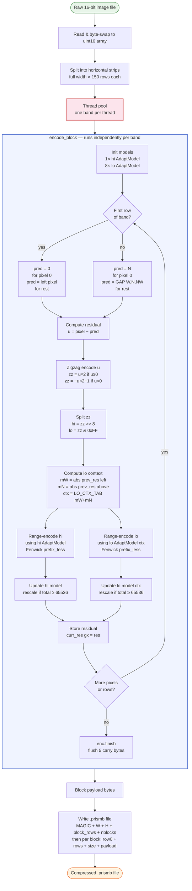
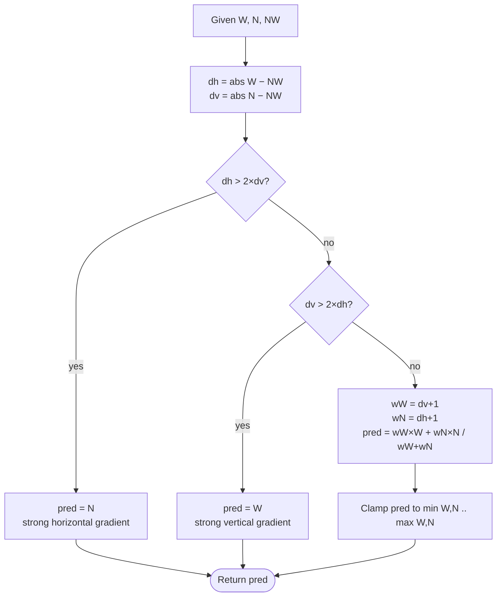
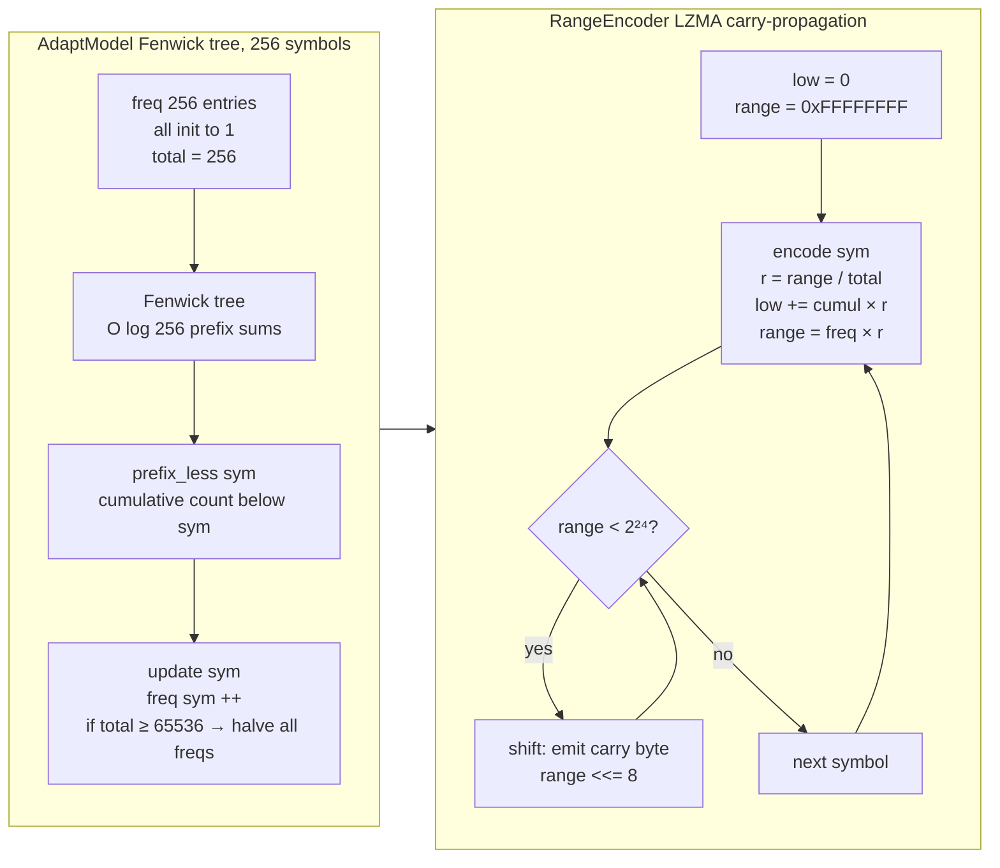

# PRISM-Block Flow Diagram



## Decoder Flow

```mermaid
flowchart TD
    A([Compressed .prismb file]) --> B[Read header\nW × H × block_rows × nblocks]
    B --> C[Read all block payloads into memory]
    C --> D[Thread pool\none block per thread]

    subgraph DECODE ["decode_block  —  runs independently per band"]
        direction TB
        E[Init models\n1× hi + 8× lo AdaptModel] --> F
        F[Init RangeDecoder\nload 5 seed bytes] --> G

        G{First row\nof band?} -- yes --> H[pred = 0 pixel 0\npred = left pixel rest]
        G -- no --> I[pred = prev_img 0 pixel 0\npred = GAP W N NW rest]

        H --> J[Compute lo context\nmW + mN from residual history]
        I --> J

        J --> K[Decode hi byte\nfrom hi AdaptModel]
        K --> L[Decode lo byte\nfrom lo AdaptModel ctx]

        L --> M[Reconstruct zz\nzz = hi<<8 | lo]
        M --> N[Zigzag decode\nu = zz/2 if even\nu = 65536 − zz+1 /2 if odd]
        N --> O[Recover pixel\npixel = pred + u]

        O --> P[Update both models]
        P --> Q{More pixels\nor rows?}
        Q -- yes --> G
        Q -- no --> R[Write row big-endian\nto output buffer at row offset]
    end

    D --> DECODE
    DECODE --> S[Assembled output buffer\nwidth × height × 2 bytes]
    S --> T([Decoded raw file])

    style DECODE fill:#f0f4ff,stroke:#4466cc,stroke-width:1.5px
    style A fill:#fff3e0,stroke:#e65100
    style T fill:#e8f5e9,stroke:#2e7d32
    style D fill:#fce4ec,stroke:#c62828
```

## GAP Predictor Detail



## Adaptive Model & Range Coder Detail


